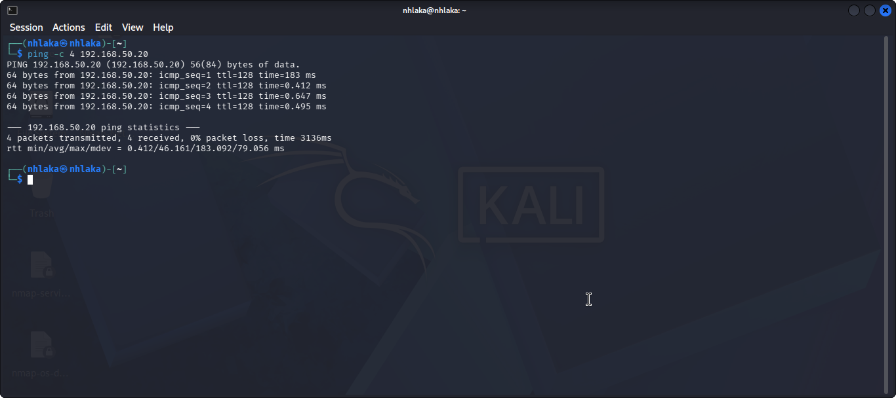
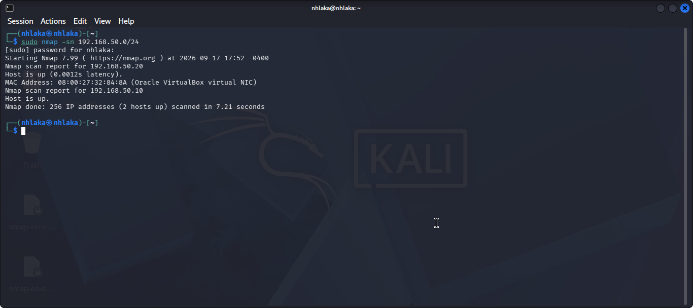
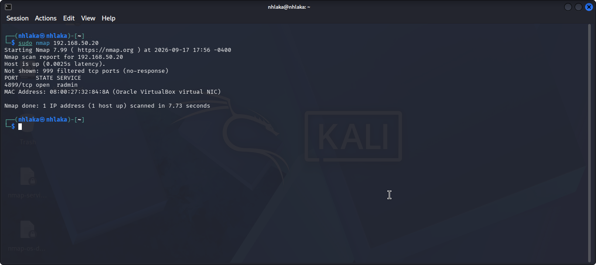
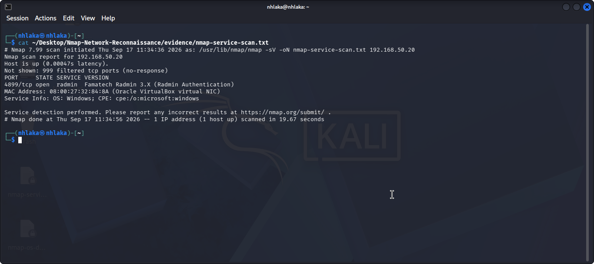
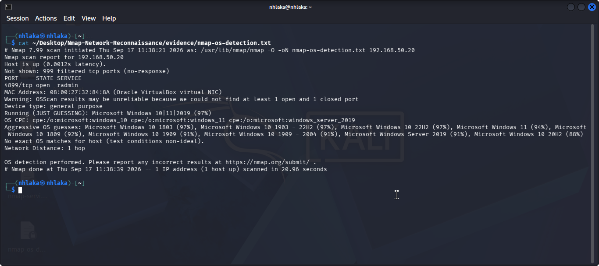
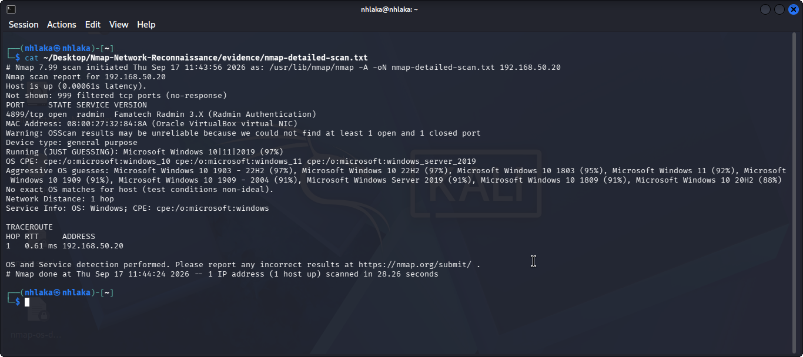

# 🔍 Nmap Network Reconnaissance Lab

## 📌 Project Overview

This project demonstrates network reconnaissance and service enumeration using **Nmap** within an isolated VirtualBox cybersecurity lab.

The objective of this project was to:

- Discover active hosts on the network
- Identify open TCP ports
- Detect running services and service versions
- Perform operating system fingerprinting
- Analyze exposed network services
- Document reconnaissance findings and security observations

All scanning activities were performed against systems within my own controlled VirtualBox lab environment.

---

## 🧪 Lab Environment

The lab consists of two virtual machines running inside **Oracle VirtualBox**.

| Machine | Purpose | Internal IP |
|---|---|---|
| Kali Linux | Reconnaissance / Security Analyst Machine | `192.168.50.10` |
| Windows 10 | Target Machine | `192.168.50.20` |

### Network Architecture

Both virtual machines use two network adapters:

**Adapter 1 — NAT**

Provides Internet connectivity to each virtual machine.

**Adapter 2 — Internal Network**

VirtualBox Internal Network name:

`cyberlab`

Internal subnet:

`192.168.50.0/24`

This provides an isolated environment where security testing can be performed without scanning external systems.

---

## 🌐 Connectivity Verification

Before beginning reconnaissance, connectivity between Kali Linux and the Windows target was verified.

From Kali Linux:

```bash
ping -c 4 192.168.50.20
```

Result:

```text
4 packets transmitted, 4 received, 0% packet loss
```

This confirmed successful communication between the Kali reconnaissance machine and the Windows target.

### 📸 Evidence



---

## 🔎 2. Host Discovery

The first reconnaissance step was to identify active hosts on the internal `192.168.50.0/24` network.

### Command

```bash
sudo nmap -sn 192.168.50.0/24
```

### Command Explanation

- `sudo` — runs Nmap with elevated privileges.
- `nmap` — launches the Nmap network scanner.
- `-sn` — performs host discovery without conducting a port scan.
- `192.168.50.0/24` — specifies the entire cyberlab subnet as the scan range.

### Results

Nmap discovered two active hosts:

| IP Address | System |
|---|---|
| `192.168.50.10` | Kali Linux |
| `192.168.50.20` | Windows 10 Target |

The Windows target was also associated with an Oracle VirtualBox virtual network interface.

```text
Nmap scan report for 192.168.50.20
Host is up.

Nmap scan report for 192.168.50.10
Host is up.

Nmap done: 256 IP addresses (2 hosts up)
```

### Analysis

The host discovery scan confirmed that both virtual machines were active and reachable on the isolated cyberlab network.

The Windows system at `192.168.50.20` was selected as the target for the subsequent reconnaissance scans.

### 📸 Evidence



---
## 🔐 3. TCP Port Scanning

After identifying the Windows target, a standard Nmap TCP scan was performed to identify exposed ports.

### Command

```bash
sudo nmap 192.168.50.20
```

### Results

```text
PORT      STATE   SERVICE
4899/tcp  open    radmin
```

Nmap reported that **TCP port 4899** was open on the Windows target.

The remaining ports in Nmap's default 1,000-port scan did not respond to the probes and were reported as filtered.

### Understanding the Result

| Field | Meaning |
|---|---|
| `4899/tcp` | TCP port 4899 |
| `open` | A service is accepting connections on this port |
| `radmin` | Nmap's initial service association for port 4899 |

At this stage, the `radmin` label alone did not prove that Radmin software was running. Nmap initially associates known port numbers with services using its service database.

Service/version detection was therefore performed next to determine what was actually listening on the port.

### 📸 Evidence



---

## 🔬 4. Service and Version Detection

To investigate the service running on TCP port 4899, Nmap service/version detection was performed.

### Command

```bash
sudo nmap -sV 192.168.50.20 -oN nmap-service-scan.txt
```

### Command Explanation

- `-sV` — probes open ports to identify running services and, where possible, their versions.
- `-oN` — saves the results using Nmap's normal text output format.
- `nmap-service-scan.txt` — evidence file containing the scan results.

### Results

```text
PORT      STATE   SERVICE   VERSION
4899/tcp  open    radmin    Famatech Radmin 3.X (Radmin Authentication)
```

### Analysis

Service detection provided stronger evidence that TCP port `4899` was running:

**Famatech Radmin 3.X (Radmin Authentication)**

Radmin is remote administration software. A remotely accessible administration service increases the system's network attack surface and should therefore only be exposed when required and protected using appropriate access controls.

The scan output was preserved in:

```text
evidence/nmap-service-scan.txt
```
### 📸 Evidence



---
## 💻 5. Operating System Detection

Nmap OS fingerprinting was performed to estimate the operating system running on the target.

### Command

```bash
sudo nmap -O 192.168.50.20 -oN nmap-os-detection.txt
```

### Command Explanation

- `-O` — enables operating system detection.
- `-oN` — saves the scan results in normal Nmap text format.
- `nmap-os-detection.txt` — output file containing the OS detection results.

### Results

Nmap identified the target as belonging to the **Microsoft Windows** operating system family.

The scan produced several possible Windows fingerprints, including Windows 10, Windows 11, and Windows Server variants.

Nmap also displayed the following warning:

```text
Warning: OSScan results may be unreliable because we could not find
at least 1 open and 1 closed port
```

The highest fingerprint confidence reported was approximately:

```text
Microsoft Windows 10|11|2019 (97%)
```

### Analysis

The scan strongly suggested that the target was running a Microsoft Windows operating system.

However, the result should not be interpreted as definitive identification of a specific Windows version.

Nmap OS detection works by comparing network responses against known operating-system fingerprints. In this scan, most TCP ports were filtered, and Nmap did not have the combination of open and closed ports it prefers for accurate fingerprinting.

Therefore, the finding is documented as:

> **Likely Microsoft Windows operating system; exact version identification was inconclusive due to limited fingerprinting conditions.**

The OS detection evidence was preserved in:

```text
evidence/nmap-os-detection.txt
```
### 📸 Evidence



---

## 🚀 6. Detailed Nmap Scan

A more comprehensive Nmap scan was then performed against the Windows target.

### Command

```bash
sudo nmap -A 192.168.50.20 -oN nmap-detailed-scan.txt
```

### What `-A` Enables

Nmap's `-A` option enables several advanced detection capabilities, including:

- Operating system detection
- Service/version detection
- Default Nmap Scripting Engine (NSE) scripts
- Traceroute

### Key Findings

| Finding | Result |
|---|---|
| Target | `192.168.50.20` |
| Host Status | Up |
| Open TCP Port | `4899/tcp` |
| Service | Radmin |
| Detected Software | Famatech Radmin 3.X |
| Authentication | Radmin Authentication |
| OS Family | Microsoft Windows |
| Network Distance | 1 hop |
| Environment | Oracle VirtualBox |

The detailed scan confirmed the previous reconnaissance findings and provided additional information about the target's network distance and operating-system fingerprint.

The complete scan output was preserved in:

```text
evidence/nmap-detailed-scan.txt
```
### 📸 Evidence



---
## 🛡️ 7. Security Findings and Recommendations

The reconnaissance process identified one externally reachable TCP service on the Windows target.

### Finding 1 — Remote Administration Service Exposed

**Port:** `4899/tcp`  
**Service:** Radmin  
**Detected Software:** Famatech Radmin 3.X  
**Target:** `192.168.50.20`

Nmap identified a remote administration service listening on TCP port 4899.

Remote administration services provide legitimate functionality but also increase the attack surface of a system because they provide a network-accessible management interface.

### Security Considerations

Potential security concerns associated with an exposed remote administration service include:

- Unauthorized connection attempts
- Credential-based attacks
- Exposure of unnecessary administrative services
- Increased attack surface
- Risks associated with outdated or vulnerable software versions

The presence of an open port does **not** by itself indicate that the system has been compromised or that the service is vulnerable.

Further vulnerability assessment would be required before making such a determination.

### Recommended Mitigations

1. **Verify Business Requirement**

   Confirm that the Radmin service is actually required. Unnecessary remote administration services should be disabled.

2. **Restrict Network Access**

   Use host-based or network firewall rules to restrict TCP port `4899` to trusted management systems or networks.

3. **Use Strong Authentication**

   Administrative access should use strong credentials and appropriate authentication controls.

4. **Maintain Software Updates**

   Keep remote administration software updated with current security patches.

5. **Monitor Remote Access**

   Monitor authentication attempts and remote administration activity for suspicious behavior.

6. **Apply Least Exposure**

   Administrative services should only be reachable from systems that genuinely require access.

---

## 📊 8. Reconnaissance Summary

The reconnaissance process followed a structured workflow:

```text
Network Connectivity
        ↓
Host Discovery
        ↓
TCP Port Discovery
        ↓
Service Enumeration
        ↓
OS Fingerprinting
        ↓
Detailed Reconnaissance
        ↓
Security Analysis
```

### Final Findings

| Category | Finding |
|---|---|
| Reconnaissance Host | Kali Linux `192.168.50.10` |
| Target Host | Windows 10 `192.168.50.20` |
| Active Hosts Discovered | 2 |
| Open TCP Ports | `4899/tcp` |
| Detected Service | Radmin |
| Service Detection | Famatech Radmin 3.X |
| OS Fingerprint | Microsoft Windows family |
| Network Distance | 1 hop |
| Lab Platform | Oracle VirtualBox |

---

## 🧠 9. Skills Demonstrated

This project demonstrates practical experience with:

- Network reconnaissance
- Nmap host discovery
- TCP port scanning
- Service enumeration
- Version detection
- Operating system fingerprinting
- Network troubleshooting
- TCP/IP addressing and subnetting
- VirtualBox network configuration
- Windows Firewall configuration
- Security finding analysis
- Technical documentation
- Evidence collection

---

## ⚠️ Ethical Use

All reconnaissance activities demonstrated in this project were performed against systems within my own isolated cybersecurity lab.

Nmap and similar security tools should only be used against systems for which explicit authorization has been granted.